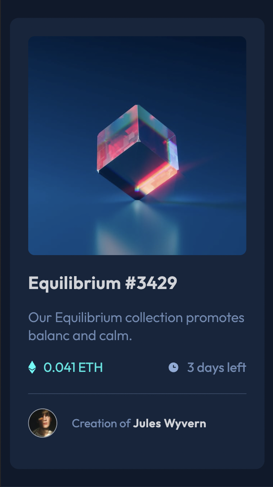
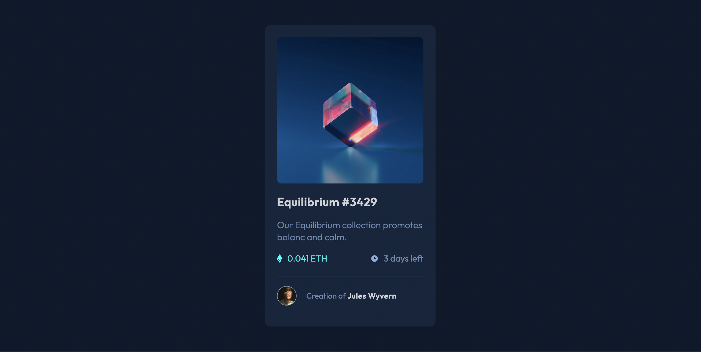
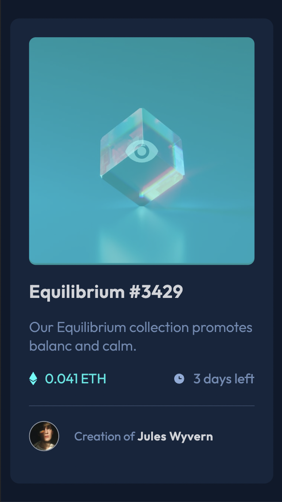

# Frontend Mentor - NFT card component

---

## Table of Content

* [Useful Links](#useful-links)
* [Mobile version](#mobile)
* [Desktop version](#desktop)
* [Active state](#active)

---

### Useful Links 

* [FM - NFT card component](https://www.frontendmentor.io/challenges/nft-preview-card-component-SbdUL_w0U)

* [Vercel: My Solution](https://fm-02-nft-preview-card.vercel.app/)

--- 
### Mobile version 

--- 
### Desktop version 

---
### Desktop version 

